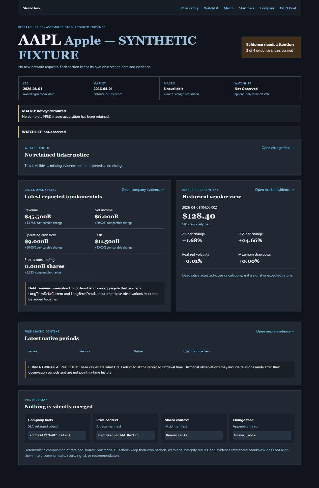
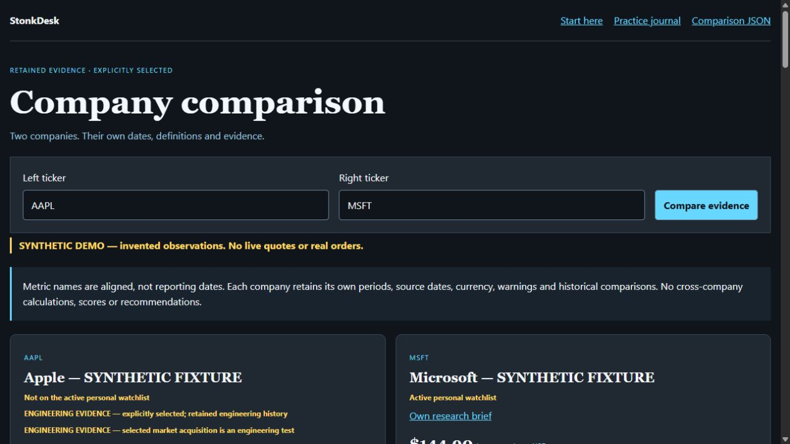

# StonkDesk

**A personal stock-research and data-monitoring prototype that keeps evidence, dates, and uncertainty visible.**

Built with AI-assisted development. This public repository contains screenshots and a project overview; application source and operational data remain private.

## What it does

StonkDesk organizes company research and shows where information is missing, outdated, or difficult to compare. It keeps source dates and warnings visible instead of presenting uncertain information as settled fact.

It brings company filings, historical prices, economic indicators, and data-collection checks into a local research interface. Opening a research page uses saved data without starting a new download.

The interesting part is handling imperfect inputs: missing observations stay missing, overlapping accounting concepts stay unresolved, and a requested date range is distinguished from the data actually returned.

## Research brief

**All screenshots use invented fixture data in an isolated demo with outbound requests blocked.** Real ticker labels identify demo cases; prices, fundamentals, dates, and watchlist membership are synthetic. These are actual application captures, not design mockups or investment results.

This example has company and price data, but no saved economic data or change notice for the watchlist. The page shows those gaps. It also flags overlapping debt figures instead of adding them together and counting the same debt twice.

## Company comparison

The comparison aligns metric names while preserving each company's reporting periods, warnings, and source dates. It does not turn mismatched observations into a common score or recommendation. Watchlist labels above belong to the demo fixture.

## Examples of data-quality behavior

| Situation | How it is represented |
| --- | --- |
| No saved change notice | Missing evidence, rather than a claim that nothing changed |
| No saved economic data | An unavailable section with an explicit warning |
| Overlapping debt concepts | An unresolved value rather than double-counting |
| Different reporting periods | Each company's own period is retained |
| Returned market data ends before the requested range | A separate latest-observation date and an explicit warning |

The Collector Observatory also distinguishes unobserved scheduled runs, recorded failures, and integrity mismatches. An absent run record alone does not prove why a scheduled run was missed.

## Status and verification

This is an ongoing personal project, not a public trading service. There is no hosted demo or application download in this repository.

For this showcase, the research and comparison pages were opened and visually checked using isolated synthetic fixtures. The implementation and automated test sources were also reviewed for the behaviors described here; the full automated suite was not rerun for this publication. These checks are separate from manual testing performed by the project owner.

The screenshots demonstrate interface behavior, not provider reliability, investment performance, or production readiness. Adjusted historical prices and economic figures downloaded today may include later revisions. They do not establish exactly what someone could have known at an earlier date.

## About

I'm Chase. I choose the direction, explore features, and use AI assistance to implement and refine my projects. StonkDesk is an exercise in making research software explain what it knows and what it cannot establish.

[More projects](https://github.com/chaser777f)
